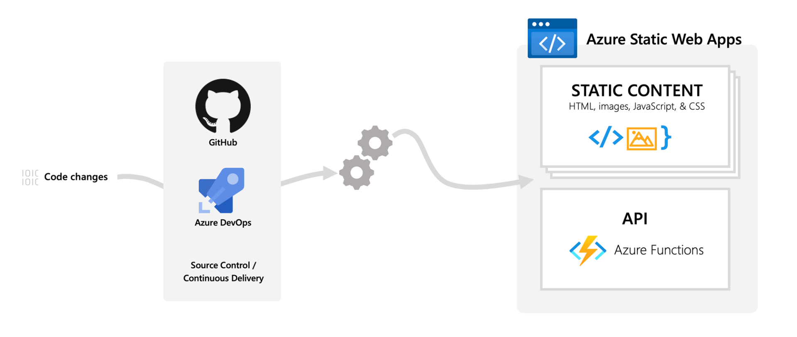

# Challenge 1 - Basic SPA
[< Previous Challenge](./Challenge-00.md) - **[Home](../readme.md)** - [Next Challenge>](./Challenge-02.md)

## Pre-requisites
Make sure you have completed the [pre-requisites in Challenge 0](./Challenge-00.md).

## Introduction
A single page application (SPA) is web application that dynamically updates the page rather than refreshing the page with a round trip to the server. Static content combined with client JavaScript to call server APIs forms the basis of a SPA. Often you'll also find frameworks such as [Angular](https://angular.io/), [React](https://reactjs.org/) or [Vue.js](https://vuejs.org/). 

In this challenge we will create a very simple SPA using Azure Static Web Apps to provide the storage for the static content, serverless functions for APIs and a DevOps wrapper to provide source control and CI/CD.

The architecture of Azure Static Web Apps is shown below.

## Description
Deploy a basic single page application using Azure Static Web Apps.

## Success Criteria
1. In the Azure Portal, verify an Azure Static Web App resource is deployed
2. Verify the site is functioning by browsing to the generated URL
3. Verify a GitHub action has been created to deploy the web app

## Learning Resources
* [What is Azure Static Web Apps?](https://docs.microsoft.com/azure/static-web-apps/overview)
* [Creating an Azure Static Web App](https://docs.microsoft.com/azure/static-web-apps/get-started-portal)

## Tips
* Use the "No Framework" template [GitHub Template including the starter app](https://github.com/staticwebdev/vanilla-basic/generate)
